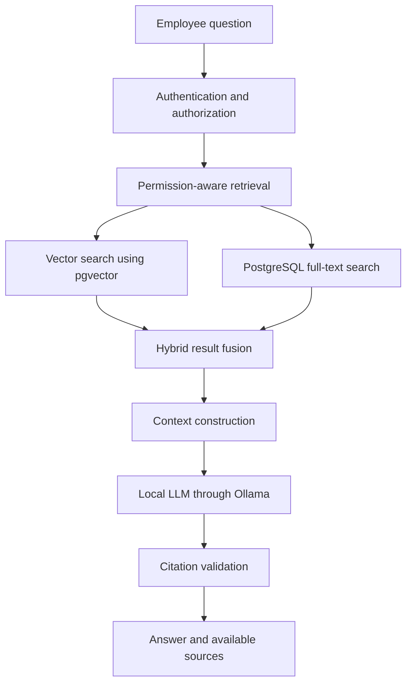
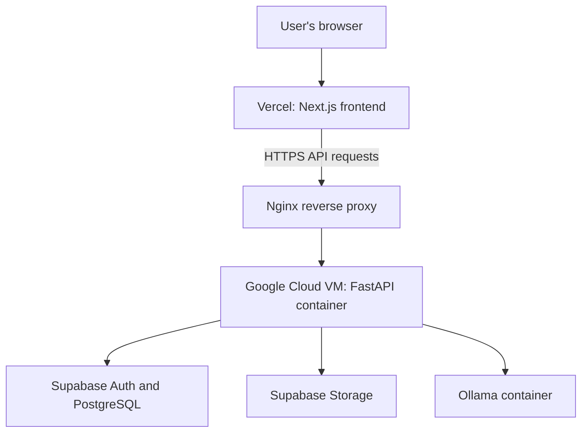

# KnowledgeHub AI

**A multi-tenant enterprise knowledge platform with permission-aware Retrieval-Augmented Generation (RAG).**

KnowledgeHub AI helps organizations manage private documents and lets employees ask natural-language questions about company knowledge they are authorized to access.

## Live Demo

- **Web application:** https://knowledgehub-ai-rose.vercel.app
- **Backend API:** https://knowledgehub-ai.duckdns.org
- **API documentation:** https://knowledgehub-ai.duckdns.org/docs
- **GitHub repository:** https://github.com/Chanduchandan2810/knowledgehub-ai

> The application uses a local language model for generation. Demo availability and response times depend on the deployed services.

## The Problem

Organizations store important knowledge across policies, employee handbooks, and internal documents. Finding the right information can be time-consuming, while sending confidential company documents to public AI services can create privacy risks.

KnowledgeHub AI addresses this problem with a private, organization-scoped knowledge platform that retrieves authorized document content and uses it to generate context-aware answers with source citations.

## Features

- **Multi-tenant architecture:** Organization-scoped data access enforced by backend authorization and database queries.
- **Role-based access control:** Separate Admin and Employee experiences.
- **Document management:** Upload and manage organizational documents through the web interface.
- **Document ingestion:** Extract text, create chunks, and generate embeddings using a local sentence-transformer model.
- **Semantic search:** Store and retrieve document embeddings using PostgreSQL with pgvector.
- **Hybrid retrieval:** Combine vector similarity search with PostgreSQL full-text search using weighted retrieval fusion.
- **RAG-powered chat:** Generate answers using retrieved document context and a locally hosted language model.
- **Source citations:** Validate citation references against retrieved source material and display available supporting documents.
- **Document permissions:** Restrict document access according to the configured organization and permission rules.
- **Security controls:** Authentication, authorization checks, cross-tenant access protections, input validation, and prompt-injection-aware context construction.
- **Rate limiting:** Apply request limits to help protect application endpoints.
- **Observability:** Request logging, health checks, and RAG pipeline timing information.
- **Controlled AI tools:** Support selected document comparison and summarization workflows through a controlled Knowledge Analyst router.
- **Demo sandbox:** Provide a separate demo experience using the application's real processing and retrieval pipeline.

## User Roles

### Admin
- Manage organization-level resources.
- Upload and manage company documents.
- Manage employee accounts.
- Configure document access permissions.
- Use administrative features for the organization.

### Employee
- Access the employee portal.
- Ask questions about authorized company knowledge.
- View available source citations.
- Access personal profile and settings features supported by the application.

## Technology Stack

| Layer | Technologies |
|---|---|
| Frontend | Next.js App Router, React, TypeScript, Tailwind CSS, Lucide React |
| Backend | Python, FastAPI, SQLAlchemy Async, asyncpg |
| Database | Supabase PostgreSQL, pgvector |
| Authentication | Supabase Auth |
| Database migrations | Alembic |
| Embeddings | `sentence-transformers/all-MiniLM-L6-v2` |
| LLM inference | Ollama, `llama3.2:1b-instruct-q4_K_M` |
| Document storage | Supabase Storage |
| Containers | Docker, Docker Compose |
| Deployment | Vercel, Google Cloud VM, Nginx, HTTPS |
| CI/CD | GitHub Actions |
| Testing | Pytest, frontend linting, production-build checks, Docker build validation |

## System Architecture

KnowledgeHub AI uses a modular monolith architecture: a Next.js frontend communicates with a FastAPI backend, which coordinates authentication, document processing, retrieval, and AI generation.

### RAG Pipeline



### Document Ingestion

1. An authorized user uploads a document.
2. The backend validates the request and stores the original file in private object storage.
3. The processing pipeline extracts text and splits it into chunks.
4. A local sentence-transformer model generates embeddings.
5. Document metadata, chunks, permissions, and embeddings are stored in PostgreSQL.
6. Future questions retrieve relevant content subject to the application's authorization rules.

### Production Deployment



The production frontend is deployed on Vercel. The backend and local LLM inference service run on the Google Cloud VM, with Nginx terminating HTTPS and forwarding API requests to FastAPI.

## Security and Tenant Isolation

Security is an important part of the application design.

- Authentication is handled through Supabase Auth.
- Backend authorization determines the user's organization and role.
- Organization-scoped queries restrict access to tenant-specific resources.
- Document retrieval applies the configured access permissions before content is used to construct an answer.
- Cross-tenant and cross-user access scenarios are covered by security regression tests.
- Request validation, rate limiting, and prompt-injection-aware context construction provide additional protections.

**Note:** Tenant isolation is enforced through application-level authorization and scoped queries. This README does not claim that PostgreSQL Row-Level Security (RLS) is the primary enforcement mechanism.

## Controlled AI Workflows

The Knowledge Analyst supports selected workflows, including:

- Standard knowledge questions using RAG.
- Comparison of explicitly named documents.
- Summarization of explicitly named documents.

The workflows use the application's retrieval and authorization controls rather than granting unrestricted access to organizational data.

## Repository Structure

```text
knowledgehub-ai/
├── backend/
│   ├── alembic/          # Database migrations
│   ├── app/
│   │   ├── api/          # API endpoints
│   │   ├── core/         # Configuration and security
│   │   ├── db/           # Database session management
│   │   ├── models/       # Database models
│   │   ├── schemas/      # Request and response schemas
│   │   └── services/     # Business logic and RAG pipeline
│   ├── tests/            # Backend and security tests
│   ├── Dockerfile
│   └── requirements.txt
├── frontend/
│   ├── app/              # Pages, layouts, and portals
│   ├── components/       # Shared UI components
│   ├── Dockerfile
│   └── package.json
├── docker-compose.yml
├── .github/
│   └── workflows/
│       └── ci.yml
├── .env.example
└── README.md
```

This is a representative structure; consult the repository for the complete file tree.

## Running Locally

### Prerequisites

- Git
- Docker Engine and Docker Compose, or the required Python and Node.js runtimes for native development
- A Supabase project with the required database, authentication, and storage configuration
- The environment variables documented in `.env.example`

### Docker Compose

1. Clone the repository:

   ```bash
   git clone https://github.com/Chanduchandan2810/knowledgehub-ai.git
   cd knowledgehub-ai
   ```

2. Create the local environment file:

   ```bash
   cp .env.example .env
   ```

   On Windows PowerShell:

   ```powershell
   Copy-Item .env.example .env
   ```

3. Fill in the required values using `.env.example` as the source of truth. Do not commit `.env` or publish credentials.

4. Start the application:

   ```bash
   docker compose up --build
   ```

5. Run database migrations to initialize the schema:

   ```bash
   docker compose exec backend alembic upgrade head
   ```

6. Open the frontend at `http://localhost:3000` and the backend API documentation at `http://localhost:8000/docs`, assuming the default ports are available and the services start successfully.

Follow the current Compose configuration for Ollama model initialization and any additional setup steps. The local environment requires valid configuration and access to the required services.

## Testing and CI/CD

The project includes automated backend tests and GitHub Actions validation.

- **Backend tests:** Pytest coverage for API behavior, authorization, tenant isolation, and security regression scenarios.
- **Frontend validation:** ESLint and Next.js production-build checks.
- **Docker validation:** Container image build checks.
- **Continuous integration:** GitHub Actions runs the backend, frontend, and Docker validation jobs.

The latest recorded local backend test run completed with **94 passed and 0 skipped**. The three CI jobs were also verified as passing at the time of the recorded run. These results describe those runs and may change as the code evolves.

Run backend tests locally:

```bash
cd backend
pytest tests/ -v
```

Run frontend checks from the frontend directory using the scripts defined in `frontend/package.json`.

## Project Status

The core application, RAG pipeline, hybrid retrieval, controlled AI workflows, deployment setup, CI/CD, and security regression tests have been implemented.

The current focus is portfolio documentation and presenting the deployed project clearly.

## Author

**Chandan R**
B.E. Information Science and Engineering

GitHub: https://github.com/Chanduchandan2810
